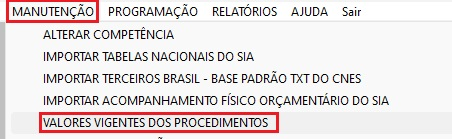
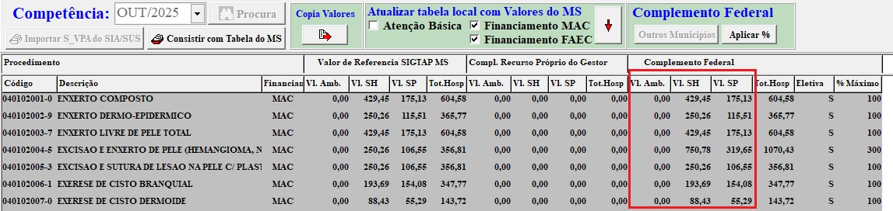

## 🚀 Automação para Zeragem dos Valores de Cirurgia Eletiva na FPO ##  
 
Este repositório contém uma automação desenvolvida para agilizar o processo de zerar os valores de Cirurgia Eletiva no sistema FPO (FPO Magnético), acessando a área:

Manutenção → Valores Vigentes dos Procedimentos
A automação foi criada para agilizar o processo de zerar os valores  o trabalho manual e minimizar erros ao ajustar os valores diretamente na interface do sistema.

 

## 📝 Instruções de Uso ##

Acesse o caminho no sistema:
Manutenção → Valores Vigentes dos Procedimentos

Localize a primeira linha cinza e deixe-a visível como a primeira linha da tela.

Execute a automação.

Ao ser solicitado, selecione o programa da FPO.

A automação irá percorrer todas as linhas, zerando os valores das colunas marcadas na imagem.

 

## ⚠️ Observação ##

O sistema pode pular algumas linhas durante a execução, portanto é necessário revisar todas as linhas após a automação.
